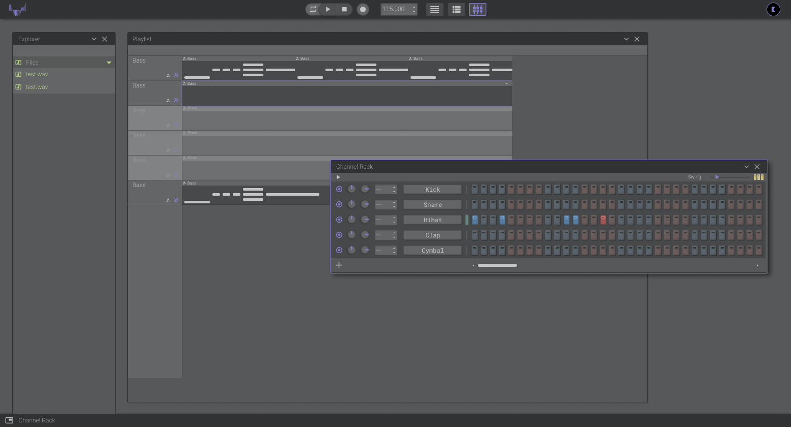

# Open DAW

> ### !NOTICE!  
> **This project is in `development`.**  

## What can I do if I'm interested?
1. You can check back in a bit if you are interested in the project
2. You can follow the progress of the development [here]()
3. You can [join]() in and help in any way you can (_all type of help is apreciated_)

## Motivation
The main motivation I had for starting this project was that, there is no **"Good Online DAW"** (_**DAW** stands for Digital Audio Workstation_) that I could find. I really enjoy it when I find a really well done web app, that works like a desktop app, for example [Figma](https://www.figma.com/) is a good example of the type of quality I would like to acomplish in this project.

Another motivation for this project would be to help people like me, when I started making music, that don't have or don't want to invest tons of money at first, and give them the ability to create good music.

My last motivation, is that this project could be a way of pushing Music Production into the js/web scene.

## Needs
What I need at the moment is:
* Get your **opinions**, **ideas**, **sugestions**
* Get the general **interest**
  * What do you think about the project?
  * Is it something you or somebody that you know, will use?
  * Would you be up to help if this project goes forward?

If the project goes forward this project would need:
* A UI designer
* Somebody that knows audio stuff :P
* Some general developers

> If you would like to help in any of this ways or think you fit some other role, please let me know.

## Steps
1. Research `current`
2. Design
3. Development (Beta)
4. Release v1.0

